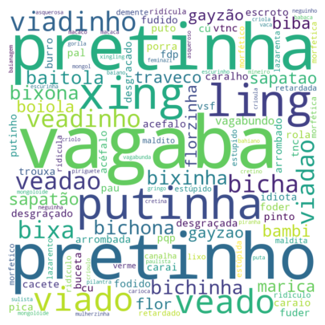

<h1 align="center">Classificador de Toxidade em comentários</h1>

<div align="center">

  [Projeto](#projeto) 
  &nbsp;&nbsp;&nbsp;|&nbsp;&nbsp;&nbsp;
  [Tecnologias](#tecnologias)
  &nbsp;&nbsp;&nbsp;|&nbsp;&nbsp;&nbsp;
  [Licença](#license)

</div>

<p align="center">
  
</p>

<br>

<div align="center">



</div>

<hr>
<br>
<br>

## 💻 Projeto <a name = "projeto"></a>

### Sobre

Este projeto tem o intuito de classificar comentários(strings) em tóxico ou não, com base em xingamentos e palavras obscenas em um determinado contexto.

O dataset é de comentários do Twitter, sendo 21 mil comentários em uma planilha csv da [ToLD-BR](https://github.com/JAugusto97/ToLD-Br).

O objetivo era utilizar dos modelos prontos de LSTM do Keras para treinamento e comparar com outro modelo, o BERT, para ver a diferença de resultados.

Projeto dado por nós durante as aulas de Redes Neurais, no 7° período de Engenharia de Software.

### Observações

Os notebooks estão separados em LSTM e BERT, o BERT está em configurado para rodar em minha máquina, logo comentei as instalações de pacotes, para rodar em um Colab, basta retirar os comentários.

O LSTM está configurado para rodar em um ambiente com GPU configurado no SpaCy, logo utilizei o Colab para evitar este trabalho. Para executar o código em sua máquina basta retirar a função ```spacy.require_gpu()``` dentro do tópico "Pré-processamento" > "Limpeza de strings".

### Comparação

#### LSTM

O modelo feito com LSTM foi desenvolvido totalmente com a API do Keras, a tokenização do dataset foi com o SpaCy e este é o resultado:

- accuracy: 68.80%
- loss: 0.6046

#### BERT

Já o modelo BERT foi desenvolvido em partes utilizando o Keras API, sendo a classe root Model, passando ela como argumento no construtor da classe DCNN e a tokenização foi utilizada a própria do BERT. Os resultados são:

- accuracy: 99.51%
- loss: 0.012
- f1_score: 12.0139
- precision: 11.9885
- recall: 12.0445

<br>
<br>

## 🚀 Tecnologias <a name = "tecnologias"></a>

- Python
- Jupyter
- Tensorflow
- Tensorflow Hub
- Keras
- Pandas
- NumPy
- MatplotLib
- Seaborn
- Unidecode
- WordCloud
- nltk
- Scikit Learn
- BERT
- SpaCy

<br>
<br>


##  🔒 Licença

Esse projeto está sob a licença MIT.

<hr>
